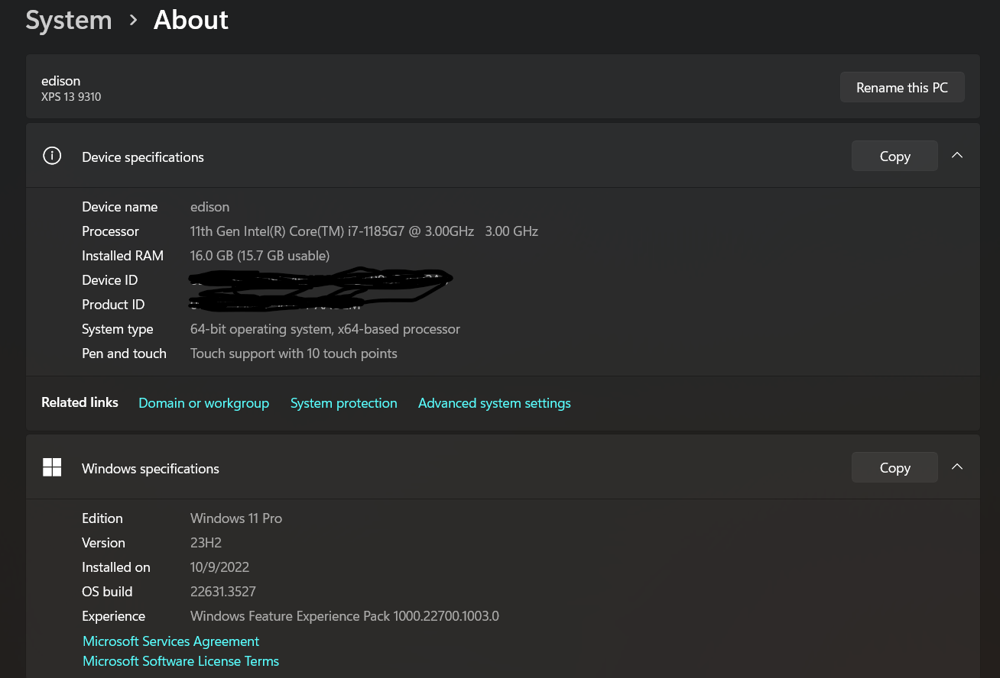
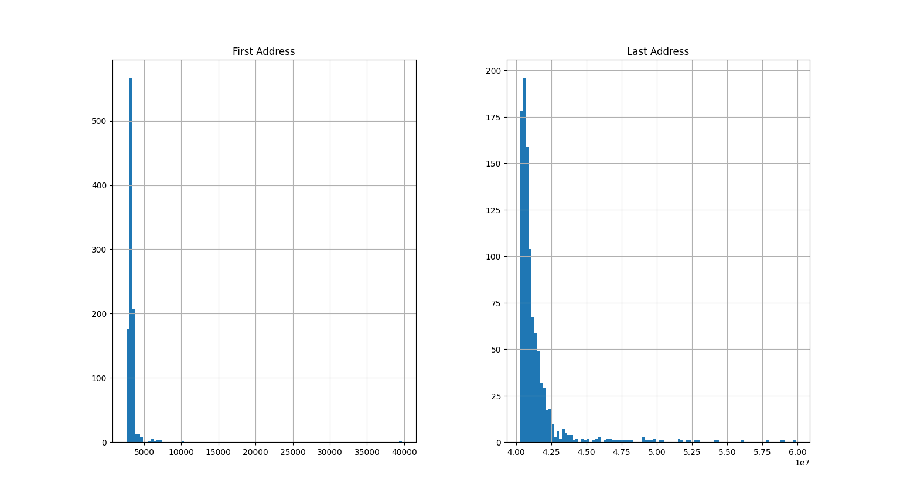
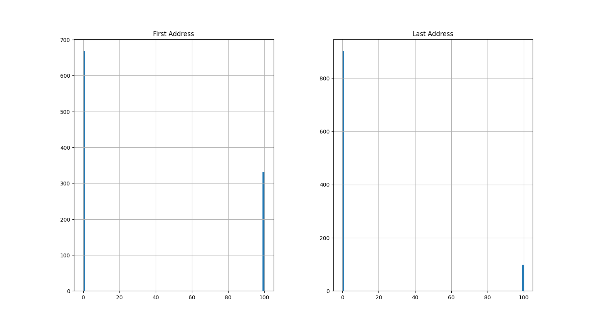

# YAML CPP
## Simulation to Measure Read Access From YAML Node
## Test Environment


## Scenario 1
Scenario 1 we read from the `YAML::Node config` for each iteration like so:
```c++
    std::string output_string = "First Address,Last Address\n";
    int ad0 = config["build_100000"]["Address"].as<int>();
    int ad1 = config["build_100000"]["Address"].as<int>();

    int N = 10000000;
    int addr999;
    int addr000;
    for(int i =0; i < N; i++)
    {
        auto start0 = std::chrono::high_resolution_clock::now();
        addr000 = config["build_1"]["Address"].as<int>();
        auto stop0 = std::chrono::high_resolution_clock::now();
        auto start1 = std::chrono::high_resolution_clock::now();
        addr999 = config["build_100000"]["Address"].as<int>();
        auto stop1 = std::chrono::high_resolution_clock::now();

        auto duration0 = std::chrono::duration_cast<std::chrono::nanoseconds>(stop0 - start0);
        auto duration1 = std::chrono::duration_cast<std::chrono::nanoseconds>(stop1 - start1);
        output_string += std::to_string(duration0.count()) + ", " + std::to_string(duration1.count()) + "\n";
        addr000 = 1;
        addr999 = 5;
    }

```

### Scenario 1 Results

### Summary Statistics (ns)
```
       First Address  Last Address
count           1000          1000
mean            3280      41445769
std             1276       2106532
min             2600      40303200
25%             3000      40566000
50%             3100      40849500
75%             3400      41419925
max            39700      59912600
Max First Address (s): 3.97e-05
Max Last Address  (s): 0.0599126
```

The worst case access for the first node in the yaml was around 39.7 us and the worst case access for the last address was around 59.9 ms.



# Scenario 2
For scenario 2 we only load the config once before starting our sim. This is expected to be much quicker since the time complexity for the map access for each iteration has been removed.

```c++
    std::string output_string = "First Address,Last Address\n";
    int ad0 = config["build_1"]["Address"].as<int>();
    int ad1 = config["build_100000"]["Address"].as<int>();

    int N = 10000000;
    int addr999;
    int addr000;
    for(int i =0; i < N; i++)
    {
        auto start0 = std::chrono::high_resolution_clock::now();
        addr000 = ad0;
        auto stop0 = std::chrono::high_resolution_clock::now();
        auto start1 = std::chrono::high_resolution_clock::now();
        addr999 = ad1;
        auto stop1 = std::chrono::high_resolution_clock::now();

        auto duration0 = std::chrono::duration_cast<std::chrono::nanoseconds>(stop0 - start0);
        auto duration1 = std::chrono::duration_cast<std::chrono::nanoseconds>(stop1 - start1);
        output_string += std::to_string(duration0.count()) + ", " + std::to_string(duration1.count()) + "\n";
        addr000 = 1;
        addr999 = 5;
    }
## Scenario 2 Results
### Summary Statistics (ns)

```
       First Address  Last Address
count           1000          1000
mean              33            10
std               47            30
min                0             0
25%                0             0
50%                0             0
75%              100             0
max              100           100
Max First Address (s): 1e-07
Max Last Address  (s): 1e-07
```
The worst case access was around 100 ns for each variable.



# Conclusion
Loading and unpacking the config prior to our dummy simulation provided significant speedups.
When one is using a YAML for config for 